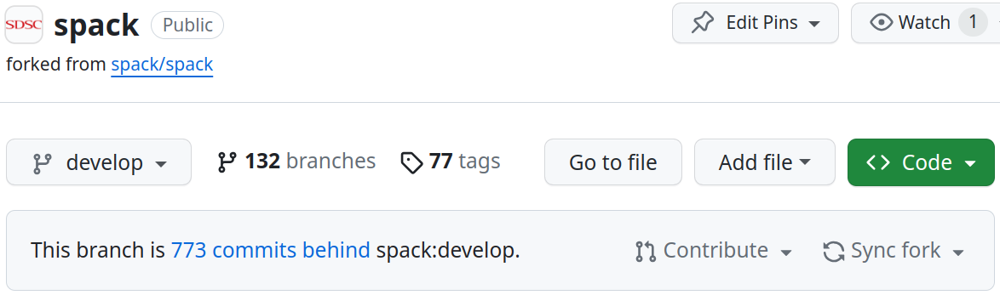

** THIS IS A DRAFT. PLEASE REFER TO THE OFFICIAL SDSC/SPACK DOCUMENTATION ***

# How to create a new issue for the sdsc/spack repo

There are a number of reasons you may need to or want to create an 
new issue for sdsc/spack repo. For example, perhaps you've recieved 
a software request from a user that we should probably to deploy 
system-wide via Spack. Or maybe the HPC Systems Group has recieved 
a report about a new Common Vulnerabilities and Exposure (CVE) that 
affects critical system software like SLURM, which our Spack 
instances rely on as an external package. 

To create a new issue, first navigate to the sdsc/spack repository at:
https://github.com/sdsc/spack. Select the *Issues* tab in the upper 
left-hand side of the page, and then click on the green *New Issue* 
button on the far right-hand side of the new page. At this time, 
you will be presented with a list of pre-defined Issue templates 
created by the Spack project. e.g., Bug Report, Build Error, etc. 
Please DO NOT choose one of these pre-defined templates at this time. 
Instead, choose *Open a Blank Issue* at the bottom of the page, 
below the pre-defined templates. In the future, we may incoporate 
the pre-defined Spack templates, or modify them for our own use. 
But at this time, we have not incorporated them into the sdsc/spack 
workflow.

After you've started to create the *New (Blank) Issue*, you'll 
need to *Add a title* before GitHub will activate the green *Submit 
new issue* button, which allows you to complete the issue creation 
process. At a minimum, the *title* of your *New Issue* should begin
with the SDSC ticket identifier and number. For example, this may
include:
- ACCESS-CI Jira Issues: `ATS-1234`
- SDSC Zendesk Tickets: `ZEN-12345`
- SDSC HPC Jira Issues: `CMT-123`, `EXP-123`, `TSC-123`, or `VOY-123`.
Please follow the ticket identifier and number with a colon and then
a short, but useful description of the issue that needs be addressed.
If the issue requires a more in-depth discussion to explain for
others, please do *Add a description* in the textbox provided before
you *Submit new issue*. At the very least, please include a link to
the original ticket for easy reference by others.

# Fetch changes, resync the `develop` branch with upstream

There are a number of cases where you will need to fetch changes from 
the `develop` branch of `spack/spack` upstream and then re-syncronize 
a target downstream `develop` branch. 

When the develop branch of the sdsc/spack repository (or your own public fork of the sdsc/spack repository) needs to be re-synchronized with the spack/spack upstream develop branch, you can fetch and merge all of the recent changes as follows:

# How to resync the deployment branch of your `personal/spack` fork with the `sdsc/spack` upstream

